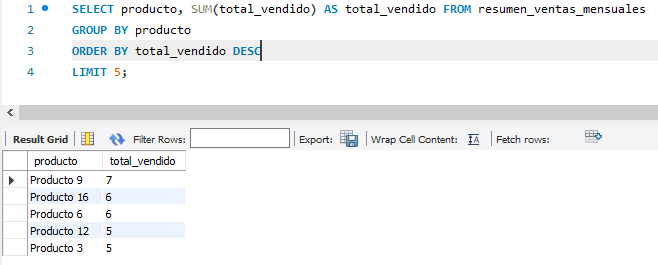
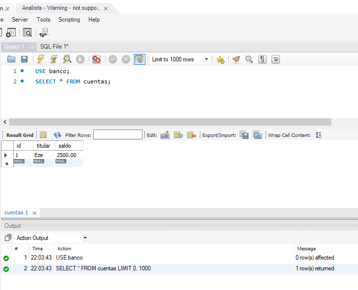

1.  Si se elimina un estudiante que este inscripto en un curso surge un problema que viola la integridad referencial porque la clave foranea de una supuesta tabla cursos ya no tendria donde apuntar.
 
Para que esto no suceda se deberia usar un ON DELETE RESTRICT.
***

2.  Creamos una tabla Matriculas, que tiene una clave foránea hacia la tabla estudiantes y otra a la tabla curso. 
 
Ingresamos los valores que violen la integridad referencial.

***

3.  READ COMMITED:
 
SESION 1: (TRANSACCION A)
<td></td>

SESION 2: (TRANSACCION B)
<td></td>

SERIALIZABLE:
 
SESION 1 (TRANSACCION A)
<td></td>

SESION 2 (TRANSACCION B)
<td></td>

***

4.  Sin Indice:

<td></td>

Con Indice:

<td></td>

***

5.  Creamos una consulta que filtra por múltiples columnas: stock, categoria y precio. 
 Primero se ejecutó sin ningún índice, despues con diferentes índices  y se compararon usando EXPLAIN.

<td></td>

<td></td>

<td></td>

***

6.   Creamos la tabla de ventas: 

<td></td>

Creamos la vista:

<td></td>

Mostramos los 5 productos mas vendidos:

<td></td>

***

7.  Creamos el usuario y le damos permisos de lectura:

<td></td>

Probamos ver la tabla cuentas:

<td></td>

Mostramos el error al insertar un producto:

<td></td>

***

8.   Creamos la base de datos y las tablas 

<td></td>

Creamos el trigger para insert

<td></td>

Creamos el trigger para update

<td></td>

Creamos el trigger para el delete

<td></td>

Probamos la auditoria 

<td></td>
<td></td>
<td></td>

***

9.   Usamos una base de datos llamada empresa y un usuario fran
 
-- Backup de una base de datos específica 
mysqldump -u fran -p empresa > backup.sql
 
-- Backup de todas las bases de datos  
mysqldump -u fran -p --all-databases > backup_full.sql
 
-- Restauración del backup  
mysql -u fran -p empresa < backup.sql
 
-- Simulacion de perdida de datos y recuperacion 
Creacion de la base de datos y una tabla:
<td></td>
 
-- Se hace el backup  
mysqldump -u fran -p empresa > backupEmpresa.sql
 
-- Se borra por "accidente" la base de datos  
DROP DATABASE empresa;
 
-- Se restaura la base de datos 
mysql -u fran -p empresa < backupEmpresa.sql